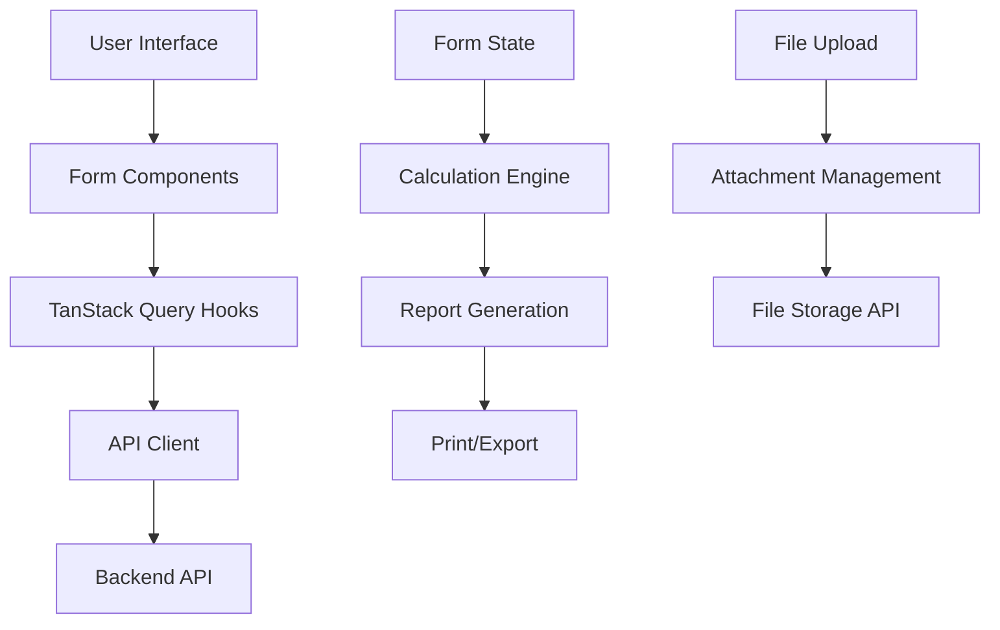

# House Rent Management System Design Document

## Overview

The House Rent Management System is a comprehensive feature built on React 18 with TypeScript, using Ant Design for UI components and TanStack Query for data management. The system provides full CRUD operations for rental property management, complex financial calculations, and professional reporting capabilities. It integrates with the existing authentication and permission system while maintaining responsive design principles.

## Architecture

### Component Hierarchy

```
House Rent Feature
├── PageHouseRent (List View)
├── PageHouseRentCreate (Creation Form)
├── PageHouseRentDetail (Edit Form)
├── PageHouseRentDetailClone (Clone Form)
├── PageHouseRentSummary (Print-Ready Report)
├── HouseRentForm (Shared Form Component)
├── Components/
│   ├── HouseRentMasterDataField
│   ├── HouseRentDetailTableField
│   ├── HouseRentMemberTableField
│   ├── HouseRentAttachments
│   ├── HouseRentReportSummary
│   ├── CustomCell
│   └── Summary Components/
│       ├── HouseRentSummaryHeader
│       ├── HouseRentSummaryContent
│       ├── BasicInfoSection
│       ├── RentalDetailsSection
│       └── MemberDetailsSection
├── Services/
│   └── house-rent-service.tsx
├── Interfaces/
│   └── house-rent-interface.ts
├── Utilities/
│   ├── house-rent-helper.tsx
│   └── house-rent-store.tsx
```

### Data Flow Architecture



### Route Structure

- `/house-rent` - Main list view (requires read permission)
- `/house-rent/create` - Creation form (requires create permission)
- `/house-rent/:houseRentId` - Edit form (requires update permission)
- `/house-rent/:houseRentId/clone` - Clone form (requires create permission)
- `/house-rent/:houseRentId/summary` - Print summary (requires read permission)

## Components and Interfaces

### Core Data Interfaces

```typescript
interface IHouseRentFormValues {
  id?: string
  name: string
  rents: IHouseRentDetailData[]
  members: IHouseRentMemberData[]
  electricitySummary: IElectricitySummaryData
  baseHouseRent: number
  paymentFee: number
  internet: { pricePerMonth: number }
  airCondition: { pricePerUnit: number; unit: number }
  attachments: UploadFile[]
}

interface IHouseRentDetailData {
  id?: string
  month: Dayjs
  houseRentPrice: number
  waterPrice: number
  electricity: { totalPrice: number; unit: number }
}

interface IHouseRentMemberData {
  id?: string
  airConditionUnit: number
  electricityUnit: { prev: number; current: number; diff: number }
  payInternetMonthIds?: string[]
  payElectricityMonthIds?: string[]
  userId: string
}

interface IElectricitySummaryData {
  totalUnit: number
  totalPrice: number
  pricePerUnit: number
  shareUnit: number
}
```

### Service Layer Design

#### API Service Hooks

```typescript
// Data fetching hooks
useGetHouseRentList() // Fetch all house rent records
useGetHouseRent(id) // Fetch single house rent record
useGetUserOptions() // Fetch user selection options

// Mutation hooks
useCreateHouseRent() // Create new house rent record
useUpdateHouseRent() // Update existing house rent record
useDeleteHouseRent() // Delete house rent record
useFetchUserOptions() // Dynamic user search
```

#### Data Transformation

The service layer handles transformation between API responses and form data:
- Converts attachment data to Ant Design UploadFile format
- Calculates electricity summaries using helper functions
- Formats dates using dayjs for consistent handling
- Manages file URLs with proper API domain configuration

### Component Specifications

#### PageHouseRent (List View)
- **Purpose**: Display all house rent records in a table format
- **Features**: 
  - Sortable columns with rental periods, members, and totals
  - Action buttons for view, edit, clone, delete, and summary
  - Permission-based button visibility
  - Responsive table design
- **Calculations**: Real-time total cost calculation for each record
- **Navigation**: Links to all related pages with lazy loading

#### HouseRentForm (Shared Form Component)
- **Purpose**: Unified form component for create/edit/clone operations
- **Features**:
  - Multi-section form with master data, rental details, and member information
  - Real-time calculation engine for electricity and cost distribution
  - File attachment management with drag-and-drop support
  - Form validation with Ant Design form rules
- **State Management**: Complex form state with interdependent calculations
- **Responsive Design**: Adaptive layout for different screen sizes

#### HouseRentReportSummary (Embedded Report)
- **Purpose**: Live calculation display within the form
- **Features**:
  - Real-time member cost calculations
  - Payment deduction tracking
  - Visual cost breakdown tables
  - Responsive table-to-card conversion for mobile

#### PageHouseRentSummary (Print Report)
- **Purpose**: Professional print-ready summary page
- **Features**:
  - A4-optimized layout with proper page breaks
  - React-to-print integration for enhanced printing
  - Responsive design that works on screen and print
  - Comprehensive financial breakdown and member details

## Data Models

### Calculation Engine

The system implements complex financial calculations:

```typescript
// Electricity cost distribution
const calculateElectricitySummary = (rents, members) => {
  const totalUnit = sumBy(rents, 'electricity.unit')
  const totalPrice = sumBy(rents, 'electricity.totalPrice')
  const pricePerUnit = round(totalPrice / totalUnit, 2)
  const totalMemberUnit = sumBy(members, 'electricityUnit.diff')
  const shareUnit = totalUnit - totalMemberUnit
  return { totalUnit, totalPrice, pricePerUnit, shareUnit }
}

// Member cost calculation
const calculateMemberCosts = (member, electricitySummary, baseData) => {
  const houseRent = baseData.baseHouseRent / members.length
  const airCondition = member.airConditionUnit * baseData.airCondition.pricePerUnit
  const internet = baseData.internet.pricePerMonth / members.length
  const individualElectricity = member.electricityUnit.diff * electricitySummary.pricePerUnit
  const sharedElectricity = (electricitySummary.shareUnit / members.length) * electricitySummary.pricePerUnit
  // ... additional calculations for deductions and final amounts
}
```

### File Management

Attachment handling follows the existing pattern:
- Upload files through the attachment API
- Store file metadata with house rent records
- Generate secure URLs for file access
- Support thumbnails for image files
- Handle file deletion and cleanup

## Error Handling

### Validation Strategy

1. **Client-side Validation**:
   - Form field validation using Ant Design rules
   - Real-time calculation validation
   - File type and size validation
   - Date range validation

2. **Server-side Error Handling**:
   - API error response handling with user-friendly messages
   - Network error recovery with retry mechanisms
   - Permission error handling with appropriate redirects
   - Data consistency validation

3. **User Experience**:
   - Loading states for all async operations
   - Optimistic updates where appropriate
   - Error boundaries for component-level error handling
   - Graceful degradation for missing data

### Error Recovery

- Form data persistence during navigation
- Auto-save functionality for long forms
- Conflict resolution for concurrent edits
- Backup and restore capabilities

## Testing Strategy

### Unit Testing
- Component rendering and interaction tests
- Calculation engine accuracy tests
- Form validation logic tests
- Service hook behavior tests

### Integration Testing
- End-to-end form submission workflows
- Print functionality across browsers
- File upload and management flows
- Permission-based access control

### Performance Testing
- Large dataset handling (100+ records)
- Complex calculation performance
- File upload performance
- Print generation speed

## Performance Considerations

### Optimization Strategies

1. **Code Splitting**:
   - Lazy loading of page components
   - Dynamic imports for heavy dependencies
   - Route-based code splitting

2. **Data Management**:
   - TanStack Query caching for API responses
   - Memoization of expensive calculations
   - Debounced user input handling
   - Optimistic updates for better UX

3. **Bundle Optimization**:
   - Tree shaking for unused code
   - Shared component reuse
   - Minimal external dependencies
   - Efficient asset loading

### Memory Management
- Proper cleanup of event listeners
- Form state cleanup on unmount
- File object cleanup after upload
- Query cache management

## Accessibility

### Screen Reader Support
- Semantic HTML structure with proper headings
- ARIA labels for complex form controls
- Table headers and captions for data tables
- Alt text for any visual elements

### Keyboard Navigation
- Tab order for all interactive elements
- Keyboard shortcuts for common actions
- Focus management in modals and forms
- Skip links for long content sections

### Visual Accessibility
- High contrast color scheme
- Scalable text and UI elements
- Color-blind friendly design
- Print-friendly high contrast mode

## Security Considerations

### Data Protection
- Input sanitization for all form fields
- File type validation for uploads
- Secure file storage and access
- SQL injection prevention

### Access Control
- Role-based permission checking
- Route-level authorization guards
- API endpoint security
- Session management integration

### Privacy
- Personal data handling compliance
- Audit trail for sensitive operations
- Data retention policies
- Secure data transmission

## Integration Points

### Authentication System
- Seamless integration with existing auth
- Permission-based feature access
- User selection and management
- Session handling and timeouts

### File Management System
- Unified attachment handling
- Secure file storage
- Thumbnail generation
- File cleanup and maintenance

### Reporting System
- Print optimization with react-to-print
- Export capabilities
- Template-based report generation
- Multi-format output support

### Navigation System
- Breadcrumb integration
- Deep linking support
- Browser history management
- Mobile navigation optimization